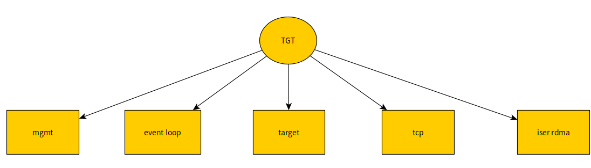
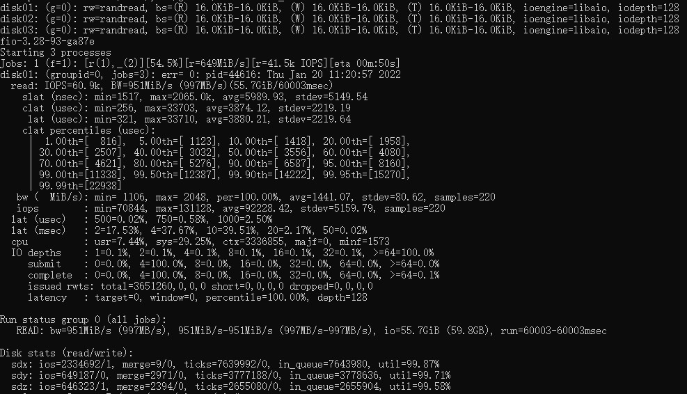
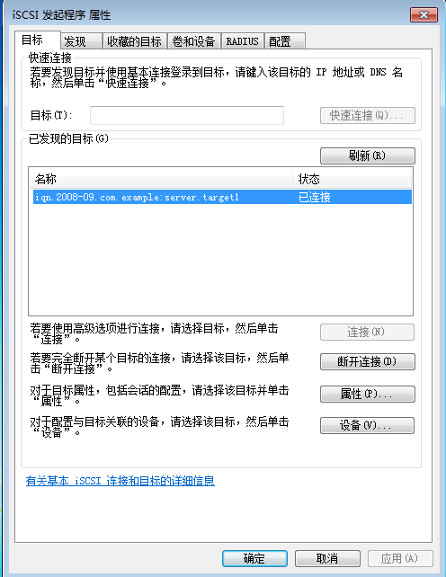
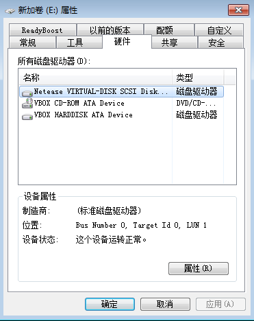
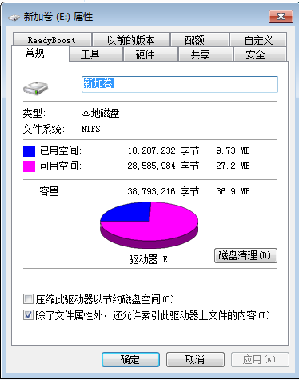

网易高性能版本tgt
================
## 1. TGT架构


### 1.1 管理模块MGMT

MGMT模块也就是管理平面，TGT的所有资源的创建、删除都从MGMT模块出发。

#### 1.1 target管理

	支持操作：OP_NEW, OP_DELETE,
	OP_BIND,OP_BIND,OP_UPDATE
	OP_SHOW,OP_STATS

#### 1.2 portal管理

	管理tcp listen port
	OP_SHOW,OP_NEW,DELETE

#### 1.3 device管理

	device又称为lun，是I/O的具体设备
	支持的操作：
	OP_NEW, OP_DELETE,OP_UPDATE,OP_STATS

#### 1.4 account管理

	帐号管理，包括CHAP, ACL等的管理
	OP_NEW, OP_DELETE,
	OP_BIND,OP_BIND,OP_UPDATE
	OP_SHOW

#### 1.5 sys管理

	主要是设置一些全局标志
	支持的操作
	OP_UPDATE,OP_SHOW

#### 1.6 session管理

	支持的操作：
	OP_STATS

#### 1.7 connection管理

	连接管理，支持的操作：
	OP_SHOW,OP_STATS,OP_DELETE

#### 1.8 lld管理

	传输层管理, iscsi_tcp, iser
	OP_START, OP_STOP,OP_SHOW

## 2. 修改tgt的目的

本tgt是基于 <A>https://github.com/fujita/tgt</A> 为基础修改而来，目的是为了利用多cpu的能力。我们观察到原版tgt使用单一主线程epoll来处理iscsi命令，还包括MGMT管理平面的unix domian socket也在这个主线程里。在10 Gbit/s网络上甚至更快的网络上，单线程（也即单cpu）处理iscsi命令的速度已经跟不上需要了，一个线程对付多个target的情况下，多个ISCSI Initiator的请求速度稍微高一点，这个单线程的cpu使用率就100%忙碌。

## 3. 修改策略

### 3.1 使用多个线程做epoll

实现多个event loop线程，每个线程负责一定数量的socket connection上的iscsi命令处理。 这样就能发挥多cpu的处理能力。

### 3.2 为每个target创建一个epoll线程

为了避免多个target共享一个epoll时依然可能出现超过单个cpu处理能力的问题，为每一个 target设置了一个epoll线程。 target epoll的cpu使用由OS负责调度，这样在各target上可以 实现公平的cpu使用。当然如果网络速度再快，依然会出现单个epoll线程处理不过来一个iscsi target上的请求，但是目前这个方案依然是我们能做的最好方案。

### 3.3 管理平面

管理平面保持了与原始tgt的兼容性。从命令行使用方面来说，没有任何区别，没有任何修改。管理平面在程序的主线程上提供服务，主线程也是一个epoll loop线程，这与原始的tgt没有区别，它负责target, lun, login/logout,discover，session, connection等的管理。ISCSI IO线程也即每一个服务于一个target上的epoll线程，不修改由管理平面管理的target,lun等数据结构。但是可能会结束session和connection。当Intiator连接到ISCSI服务器时，总是先被管理平面线程所服务，如果该connection最后需要创建session去访问某个target，那么该connection会被迁移到对应的target的epoll线程上去。

### 3.4 数据结构的锁
为每一个target提供一个mutex，当target epoll线程在运行时，这把锁是被epoll线程锁住的， 这样epoll线程可以任意结束一个sesssion或connection，当线程进入epoll_wait时，这把锁是释放了的，epoll_wait返回时又会锁住这把锁。而管理面要存取、删除一个session或者connection时， 也需要锁住这把锁，这样就可以安全地访问对应target上的session和connection了。

### 3.5 connection建立session

当login_finish成功时，login_finish有时候会创建session(如果没有session存在)。login_finish在connection结构的字段migrate_to里设置目标iscsi target。

### 3.6. connection加入到session

通常一个新的连接产生一个新的session，就如上面讲的login_finish一样。但是有一种情况，iscsi允许一个session里有多个连接，这样connection直接加入到这个session里，这是由login_security_done做的。

### 3.7 什么时候做connection迁移

当调用返回到iscsi_tcp_event_handler时，因为login_finish设置了migrate_to目标target, iscsi_tcp_event_handler就锁住目标iscsi target结构，并把该connection的fd插入到目标target的evloop 里面，完成迁移。

### 3.8 设置pthread name

设置各target event loop的线程在top中的名为tgt/n, n为target id，这样容易用top之类的工具观察哪一个target占用的cpu高。

### 3.9 一个实现例子

假如ＭＧＭＴ要删除一个target，下面的代码说明了流程：

```

／* called by mgmt */                                                            
tgtadm_err tgt_target_destroy(int lld_no, int tid, int force)                   
{                                                                               
        struct target *target;                                                  
        struct acl_entry *acl, *tmp;                                            
        struct iqn_acl_entry *iqn_acl, *tmp1;                                   
        struct scsi_lu *lu;                                                     
        tgtadm_err adm_err;                                                     

        eprintf("target destroy\n");                                            

	      ／*
        　* 这里因为控制面是单线程的，而且ＳＣＳＩ　ＩＯ线程不会删除target，
          * 所以我们找target的时候并不需要锁
          *／

        target = target_lookup(tid);                                            
        if (!target)                                                            
                return TGTADM_NO_TARGET;                                        

         /*
          * 这里要锁住target，因为我们要删除数据结构，所以不能和iscsi io
          * 线程一起共享，必须时在scsi 线程释放了锁时进行
          */

        target_lock(target);                                                    
        if (!force && !list_empty(&target->it_nexus_list)) {                    
                eprintf("target %d still has it nexus\n", tid);                 
                target_unlock(target);                                          
                return TGTADM_TARGET_ACTIVE;                                    
        }                                           
…

        /* 以上步骤删除了所有资源 ，可以释放锁了 */
        target_unlock(target);                                                  
        if (target->evloop != main_evloop) {                                    
		    /* 通知target上的evloop停止，并等待evloop 线程退出 */
                tgt_event_stop(target->evloop);                                 
                if (target->ev_td != 0)                                         
                        pthread_join(target->ev_td, NULL);                      
		    /*　下面把evloop的资源删除干净 */
                work_timer_stop(target->evloop);                                
                lld_fini_evloop(target->evloop);                                                            
                tgt_destroy_evloop(target->evloop);     
       }    
```

## 4. tgt与curve

为tgt提供了访问curve的驱动，详见doc/README.curve， 这样用户就可以在任何支持iscsi的操作系统上使用curve块设备存储，例如Windows。

## 5. 关于iser

iser target服务目前依然归属于主线程服务，因为我们还不具备测试RDMA的条件，所以这部分代码 还没有修改。

## 6. SCSI WRITE_SAME命令

WRITE_SAME是Initiator把一块数据发送过来要求target lun重复写Ｎ次。可以节约网络传输。发现EXT４文件系统就使用这个功能，因为CURVE不支持WRITE_SAME， curve tgt io驱动暂时关闭了这个功能。

## 7. 性能对比

我们为tgt配置了3块盘，一块curvebs卷，两块本地盘

```

 <target iqn.2019-04.com.example:curve.img01>
    backing-store cbd:pool//iscsi_test_
    bs-type curve
</target>

<target iqn.2019-04.com.example:local.img01>
    backing-store /dev/sde
</target>

<target iqn.2019-04.com.example:local.img02>
    backing-store /dev/sdc
</target>
```

使用本机登录iscsi
iscsiadm --mode node --portal 127.0.0.1:3260 --login

为fio设置存取这些iscsi的块设备，使用


```
[global]
rw=randread
direct=1
iodepth=128
ioengine=aio
bsrange=16k-16k
runtime=60
group_reporting

[disk01]
filename=/dev/sdx

[disk02]
filename=/dev/sdy
size=10G

[disk03]
filename=/dev/sdz
size=10G
```

测试成绩如下：

下面是未经优化的fio成绩，IOPS 38.8K


下面是经过多线程优化的fio成绩，IOPS 60.9K


## 8. Windows测试

本测试使用了虚拟机。Host OS是Linux, Linux上跑了一个virtual box和tgt，virtual box里运行的是Win7。测试结果Win7能使用ＴＧＴ输出的ＳＣＳＩ设备。




