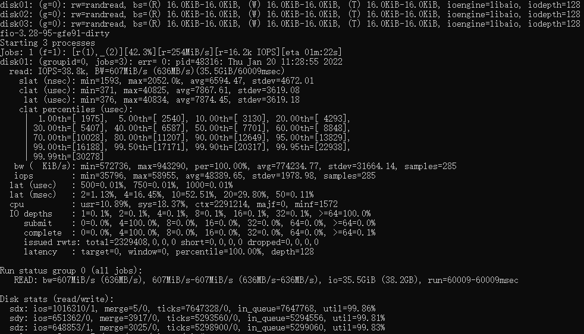

网易高性能版本tgt
================
## 1. tgt是什么

tgt是一个开源iscsi服务器，详情请见 <A>https://github.com/fujita/tgt</A>。我们在开发Curve块设备服务器时，想让更多的系统能够使用Curve块设备，而不仅仅是Linux系统，iscsi协议是一个广泛使用的块设备协议，我们想修改tgt以便让Curve提供scsi服务。

## 2. 使用tgt中碰到的问题

我们观察到原版tgt使用单一主线程epoll来处理iscsi命令，还包括管理平面的unix domian socket也在这个主线程里。在10 Gbit/s网络上甚至更快的网络上，单线程（也即单cpu）处理iscsi命令的速度已经跟不上需要了，一个线程对付多个target的情况下，多个ISCSI Initiator的请求速度稍微高一点，这个单线程的cpu使用率就100%忙碌。

## 3. 修改策略

### 3.1 使用多个线程做epoll

实现多个event loop线程，每个线程负责一定数量的socket connection上的iscsi命令处理。 这样就能发挥多cpu的处理能力。

### 3.2 为每个target创建一个epoll线程

为了避免多个target共享一个epoll时依然可能出现超过单个cpu处理能力的问题，我们为每一个 target设置了一个epoll线程。target epoll的cpu使用由OS负责调度，这样在各target上可以 实现公平的cpu使用。当然如果网络速度再快，依然会出现单个epoll线程处理不过来一个iscsi target上的请求，但是目前这个方案依然是我们能做的最好方案。

### 3.3 管理平面

管理平面保持了与原始tgt的兼容性。从命令行使用方面来说，没有任何区别，没有任何修改。管理平面在程序的主线程上提供服务，主线程也是一个epoll loop线程，这与原始的tgt没有区别，它负责target, lun, login/logout,discover，session, connection等的管理。当Intiator连接到ISCSI服务器时，总是先被管理平面线程所服务，如果该connection最后需要创建session去访问某个target，那么该connection会被迁移到对应的target的epoll线程上去。

### 3.4 数据结构的锁

为每一个target提供一个mutex，当target epoll线程在运行时，这把锁是被该线程锁住的，这样该线程可以任意结束一个sesssion或connection，当线程进入epoll_wait时，这把锁是释放了的，epoll_wait返回时又会锁住这把锁。我们修改了相关代码，让这个epoll线程不用遍历target list，只存取它服务的target相关结构，这样我们不需要target列表锁。管理面也会增加、删除一个session或者connection时，也需要锁住这把target锁。所以管理面和target epoll线程使用这个mutex来互斥，这样就可以安全地访问对应target上的session和connection了。

### 3.5 connection建立session

当login_finish成功时，login_finish有时候会创建session(如果没有session存在)。login_finish在connection结构的字段migrate_to里设置目标iscsi target。

### 3.6. connection加入到session

通常一个新的连接产生一个新的session，就如上面讲的login_finish一样。但是有一种情况，iscsi允许一个session里有多个连接，这样connection直接加入到这个session里，这是由login_security_done做的。

### 3.7 什么时候做connection迁移

当调用返回到iscsi_tcp_event_handler时，因为login_finish设置了migrate_to目标target, iscsi_tcp_event_handler就锁住目标iscsi target结构，并把该connection的fd插入到目标target的evloop 里面，完成迁移。

### 3.8 设置pthread name

设置各target event loop的线程在top中的名为tgt/n, n为target id，这样容易用top之类的工具观察哪一个target占用的cpu高。

### 3.9 一个实现例子

假如ＭＧＭＴ要删除一个target，下面的代码说明了流程：

```
/* called by mgmt */
tgtadm_err tgt_target_destroy(int lld_no, int tid, int force)
{
        struct target *target;
        struct acl_entry *acl, *tmp;
        struct iqn_acl_entry *iqn_acl, *tmp1;
        struct scsi_lu *lu;
        tgtadm_err adm_err;

        eprintf("target destroy\n");

        /*
         * 这里因为控制面是单线程的，而且ＳＣＳＩ　ＩＯ线程不会删除target，
         * 所以我们找target的时候并不需要锁
         */

        target = target_lookup(tid);                                  
        if (!target)                                            
                return TGTADM_NO_TARGET;

        /*
         * 这里要锁住target，因为我们要删除数据结构，所以不能和iscsi io
         * 线程一起共享，必须在scsi 线程释放了锁时进行
         */

        target_lock(target);                                            
        if (!force && !list_empty(&target->it_nexus_list)) {
                eprintf("target %d still has it nexus\n", tid);
                target_unlock(target);                 
                return TGTADM_TARGET_ACTIVE;
        }        
 …
        /* 以上步骤删除了所有资源 ，可以释放锁了 */
        target_unlock(target);                                               
        if (target->evloop != main_evloop) {
                /* 通知target上的evloop停止，并等待evloop 线程退出 */
                tgt_event_stop(target->evloop);                         
                if (target->ev_td != 0)                                 
                        pthread_join(target->ev_td, NULL);
                /*　下面把evloop的资源删除干净 */
                work_timer_stop(target->evloop);                      
                lld_fini_evloop(target->evloop);
                tgt_destroy_evloop(target->evloop);
       }
```

## 4. tgt与curve

为tgt提供了访问curve的驱动，详见doc/README.curve， 这样用户就可以在任何支持iscsi的操作系统上使用curve块设备存储，例如Windows。

## 5. 关于iser

iser target服务目前依然归属于主线程服务，因为我们还不具备测试RDMA的条件，所以这部分代码 还没有修改。

## 6. 性能对比

我们为tgt配置了3块盘，一块curvebs卷，两块本地盘

```

 <target iqn.2019-04.com.example:curve.img01>
    backing-store cbd:pool//iscsi_test_
    bs-type curve
</target>

<target iqn.2019-04.com.example:local.img01>
    backing-store /dev/sde
</target>

<target iqn.2019-04.com.example:local.img02>
    backing-store /dev/sdc
</target>
```

使用本机登录iscsi
iscsiadm --mode node --portal 127.0.0.1:3260 --login

为fio设置存取这些iscsi的块设备，使用


```
[global]
rw=randread
direct=1
iodepth=128
ioengine=aio
bsrange=16k-16k
runtime=60
group_reporting

[disk01]
filename=/dev/sdx

[disk02]
filename=/dev/sdy
size=10G

[disk03]
filename=/dev/sdz
size=10G
```

测试成绩如下：

下面是未经优化的fio成绩，IOPS 38.8K


下面是经过多线程优化的fio成绩，IOPS 60.9K


## 7. Windows测试

本系统对Windows经过初步测试，工作良好。具体怎么在Windows上配置iscsi客户端，可以参照：<A>https://jingyan.baidu.com/article/e4511cf37feade2b845eaff8.html</A>

## 8. CHAP

在Windows上设置CHAP认证时，请注意机密必须包含12到16个字符，要在tgt和Windows上保持一致。

